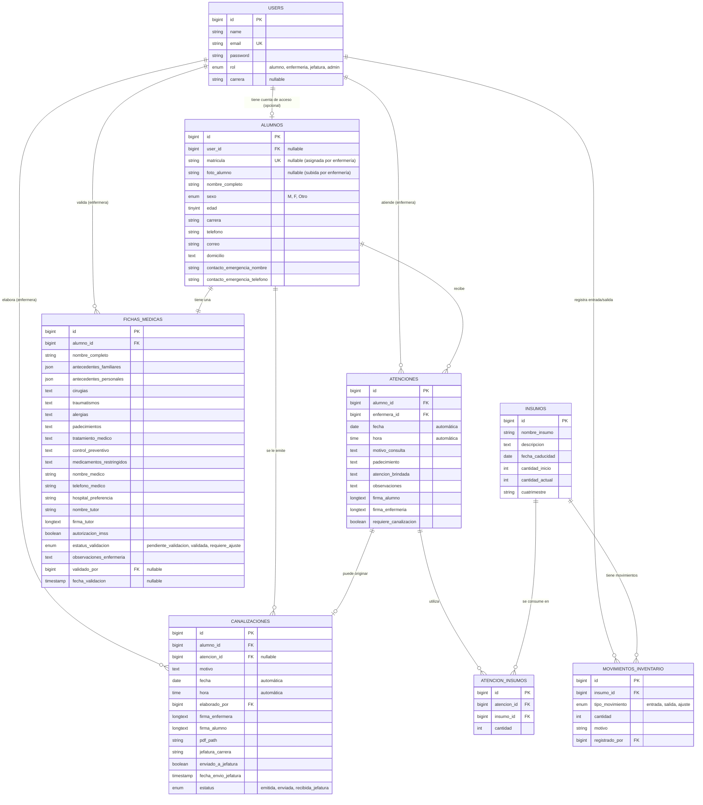

# Modelo Entidad-Relación y Diccionario de Datos — SAMU UTGZ

Este documento describe la estructura relacional de la base de datos MySQL implementada en Laravel para el **Sistema Integral de Servicios Médicos Estudiantiles de la UTGZ**.

---

## 1. Diagrama Entidad-Relación (Mermaid)

---

## 2. Reglas de Integridad y Lógica de Negocio

1. **Flujo de Ficha Médica:**
   - La tabla `alumnos` permite `matricula` y `foto_alumno` nulos inicialmente porque el alumno no los proporciona en la fase inicial desde su celular.
   - Enfermería es quien actualiza la matrícula, fotografía y cambia `estatus_validacion` a `validada` en `fichas_medicas`.
2. **Bitácora y Consumo de Insumos:**
   - Cada registro en `atenciones` almacena automáticamente `fecha` y `hora`.
   - Cuando se suministran medicamentos o materiales (ej. paracetamol, gasas), se registra en `atencion_insumos` y genera un registro de salida en `movimientos_inventario`, descontando de `insumos.cantidad_actual`.
3. **Canalizaciones y Jefatura:**
   - Las canalizaciones se asocian al alumno para extraer automáticamente sus datos de contacto y emergencia.
   - El campo `jefatura_carrera` permite a los usuarios con rol `jefatura` filtrar únicamente los alumnos de su respectiva carrera.
